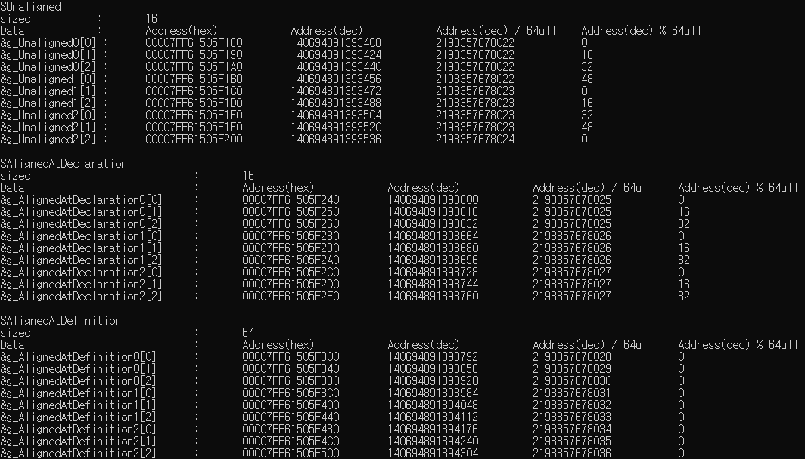

# Test-Alignas

# Table of contents

1. [Purpose](#1-purpose)  
2. [About alignas specifier](#2-about-alignas-specifier)  
2.1. [Function](#21-function)  
2.2. [How to use](#22-how-to-use)  
3. [Requirement](#3-requirement)  
4. [Result](#4-result)  

## 1. Purpose

- To test how [alignas](https://en.cppreference.com/w/cpp/language/alignas) specifier works.

## 2. About [alignas](https://en.cppreference.com/w/cpp/language/alignas) specifier

### 2.1. Function

- Specifies the alignment requirement of a variable or a type.

### 2.2. How to use

- Can be used at declaration or definition.
- If used at declaration, the alignment requirement of a variable is set to specified alignment value.
- If used at definition, the alignment requirement of a type is set to specified alignment value.

## 3. Requirement

- C++11

## 4. Result

